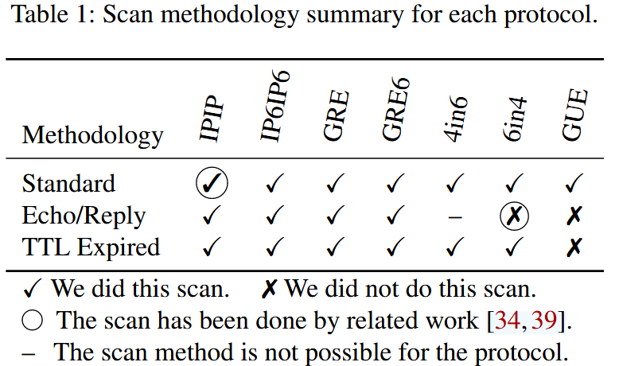

# usenix25-tunnel
Paper: A Beitis, et al. "Haunted by Legacy: Discovering and Exploiting Vulnerable Tunnelling Hosts", USENIX 25.

## Experiment


## Usage

1. zmap scan -> targets.txt

```
zmap -p 80 -B 10M -n 0.01% --output-file=targets.txt
```

2. run tunnel_scanner.py

```
sudo /home/weihua-wsl/miniconda/envs/tunnel/bin/python tunnel_scanner.py
```

```
-s / --scan-mode (扫描模式)
    standard → 不伪造，直接用真实 IP 扫描
    subnet-spoof → 修改最后一位，保持在同一子网
    spoof → 使用 SPOOF_PREFIX 的随机地址伪造源 IP
    6to4 → IPv4-mapped IPv6 地址（::ffff:x.x.x.x）

-t / --tunnel-type (隧道类型)
    ipip → IPv4-in-IPv4 (proto=4)
    gre → GRE 封装 (proto=47)
    6in4 → IPv6-in-IPv4 (proto=41)
    4in6 → IPv4-in-IPv6 (proto=41)
```

